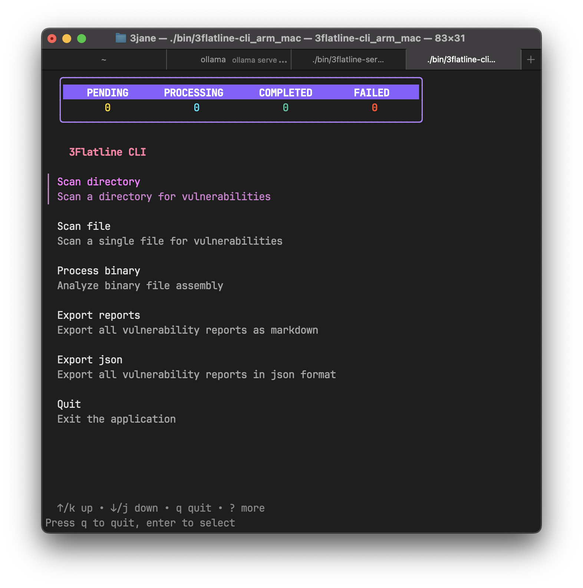
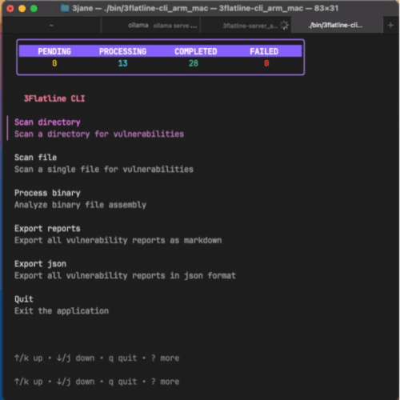
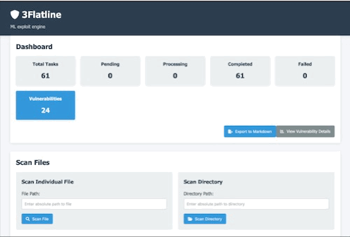

# 3Flateline

Release repositiy and bug tracker for 3flatline cli, server, and community edition.

3Flatline is a vulnerability scanning application with automated analysis. It works on source code and binary executables. There are two versions: Community and Enterprise. See features comparison below. You can request a community edition API key at aaron@3flatline.ai



## Install Instructions

3Flatline consists of 3 files: the server, the server config, and the cli.

Unzip the package but leave all of the files intact as they use relative paths for reference.

### Configuration Setup

To configure the system, you need to create a `config.ini` file. Follow these steps:

1. Copy the example configuration file:

   ```bash
   cp config.ini.example config.ini
   ```

2. Edit the `config.ini` file with your 3flatline api key (called wintermute api key in the config file) and your openai api key:

3. Turn on or off Exploits based on your needs.

> ## Dependencies and Requirements
>
> - [rizin](https://github.com/rizinorg) must be installed and added to the path to process assembly files.
> - [tree-sitter](https://github.com/tree-sitter/tree-sitter)
> - openAI API key
> - 3Flatline API key

## Usage

1. **Start the server** with your configuration:

   ```bash
   ./3flatline-server -config config.ini
   ```

2. **Use the CLI** to interact with the server:

   ```bash
   ./3flatline-cli
   ```

3. **Web interface** is also available at at `http://localhost:7270`

# REST API

Two main endpoints are available:

**Scan a file:**

```bash
curl -X POST http://localhost:7270/scanfile \
  -H "Content-Type: application/json" \
  -d '{"filePath":"path/to/file"}'
```

**Export results:**

```bash
curl -X GET "http://localhost:7270/api/export/netsage" -o export.json
```

## Local Models

If you want to keep the model local, then run the `install_ollama.sh` script on every endpoint you want to host a model on. Then be sure to update the `config.ini` file with a list of endpoints that you have ollama running on.

To use local models with Ollama:

1. **Install Ollama** on your endpoints:

   ```bash
   ./scripts/install_ollama.sh
   ```

2. **Update configuration** with your Ollama endpoints, do not include the port number:

   ```ini
   [loadbalancer]
       endpoints=localhost,server2
   ```

> ## Assembly best practices
>
> 3Flatline will support raw binary executables. It will disassebly them for you and process them. Sometimes the disassembly can have errors and tasks will fail. If you are not getting expected results, disassemble the binary with your preffered tools and scan it as a file.
>
> If you prefer to give 3Flatline assembly code as a flat text file, then use the normal scan file or scan directory features and point it to where your assembly files are located. If you go this route, you must add an extension to the files that matching the assembly language. For example: arm64 assembly must have the extension `arm_64`, MIPS as `mips`, and x86 as `x86`. As more assembly languages are added, this list will be updated. It is important that your dissasembly does not have the memory offsets in its output. This will reduce that accuracy of the output.
>
> Binary processing can take some time based on the compute power of the machine you are running on. Give the application time to process the binary before you expect to see new tasks created in the dashboard.

## Database Management

### Database Behavior

When you first run 3flatline-server, it will create a database. If the sever crashes, do not scan the same files again. The state of scanned files is in the database. Anything that didnt complete, will pick right back up after you run the server again. After a scan, it is recommended that you rename the database. Everytime you run the server, if a database doesnt exist then it will be created. This makes it easy to run a scan, change the database name, run a new scan with a new database etc. This can keep the database from becoming to unwieldly or large.

- Database is created automatically on first run
- Scans resume from where they left off after restarts
- Completed scans are stored persistently

> ## Database Best Practices
>
> **Rename databases** after scans to keep them organized:
>
>    ```bash
>    mv database.sqlite project1_scan_$(date +%Y%m%d).sqlite
>    ```

# Media





# Features

| **Feature** | **Community Edition** | **Enterprise Edition** |
|--------|:------------------:|:-------------------:|
| Code Descriptions | X | X |
| Vulnerability scanning | X | X |
| Code fixes | X | X |
| Vulnerablity POCs | X | X |
| Vulnerable Function Call Stack | X | X |
| Offline mode |  | X |


## Supported Languages

| **Language** | **Community Edition** | **Enterprise Edition** |
|--------|:------------------:|:-------------------:|
| C/C++ | X | X |
| Python | X | X |
| JavaScript/TypeScript | X | X |
| HTML | X | X |
| Java | X | X |
| Swift |  | X |
| Go |  | X |
| Ruby |  | X |
| PHP |  | X |
| C# |  | X |
| Rust |  | X |
| ObjC |  | X |
| Verilog |  | X |
| Symitar PowerOn |  | X |
| Solidity |  | X |
| MIPS |  | X |
| x86 |  | X |
| arm64 |  | X  |
| Move |  | X |
| Cairo |  | X |
| CASM (Cairo Assembly Language) |  | X |


## Supported Bug Classes

- Access Control Issues
- Array Index Out of Bounds
- Bitstream Interception
- Bounds Check Bypass Store
- Broken Access Control
- Buffer Overflow
- Cloning Attacks
- Code injection
- Command Injection
- Cross-Site Request Forgery
- Data Source Exploitation
- Delegatecall Injection
- Denial of Service (DoS)
- Flash Loan Attacks
- Floating Point and Precision Issues
- Front-Running Attack
- Gas Limit Vulnerabilities
- Hangs & Timeouts
- Improper Access Control
- Improper Authentication
- Improper Data Sanitization
- Improper Encryption
- Improper Error Handling
- Improper Input Validation
- Improper Output Encoding
- Improper Session Management
- Improper Use of Security Features
- Infinite Loop
- Insecure Deserialization
- Integer Overflow and Underflow
- Invalid Bounds Checks
- Invalid Free of Memory
- Invalid Memory Pointer
- Low Liquidity Attacks
- Meltdown RDCL
- Memory Allocation Vulnerability
- Memory Corruption
- Memory Leak
- Memory Management Error
- Memory Use After Free
- Null Pointer Dereference
- Off by One Error
- Oracle Price Manipulation Attack
- Oracles and DeFi Protocols
- Out of Bounds Read
- Out of Bounds Write
- Overbuilding
- Overflow
- Path Traversal
- Phishing with Malicious Contracts
- Race Conditions
- Randomness Vulnerabilities
- Reentrancy Attack
- Short Address Attack
- Signature Verification Vulnerability
- Speculative Store Bypass
- SQL Injection
- Stack Overflow
- Timestamp Dependence
- Type Error/Confusion
- Unchecked External Call Return Values
- Undefined Behavior
- Underflow Vulnerability
- Unhandled Exceptions
- Uninitialized Storage Pointers
- Unprotected Self-Destruct
- XSS

## Submitting bugs

Submit bugs at : https://github.com/3Flatline/3flatline_releases

## Known issues:
1. The analysis process is constantly creating and deleting tasks as it moves from coarse to fine grained analysis. This reflects in the CLI progress bar sometimes saying 100% complete before the machine creates more tasks.
1. With exploit/POC feature off, false positives are around 20%. With exploit/POC turned on, False Positives are 0. You are expected to run the generated POCs to determine which vulnerabilies reports are accurate and which are not.
